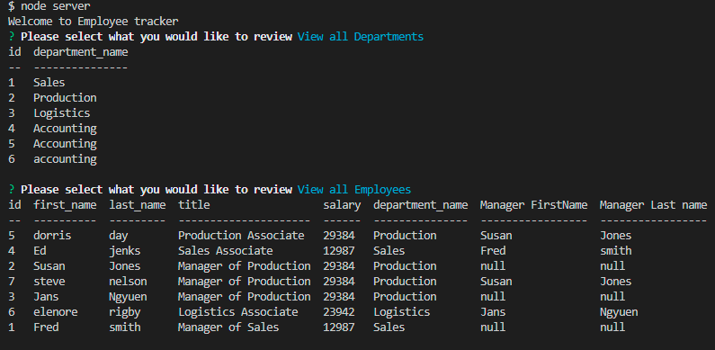

# Employee Tracker

  []

## Description:
This Content Management System (CMS) utilizes Node.js, Inquirer, and MySQLto manage a company's employee database.

## Contents
  
  
  2. [Installation](#installation)
  
  3. [Usage](#usage)
  
  4. [Contributing](#contributing)
  
  5. [Tests](#tests)
  
  
## Installation:
  
  clone the repository
  
  ---
  
## Usage:
 
 To utilize the employee tracker, go to VScode and run "node server" in your command line and follow the prompts. 
 
  ---
 
  ## License
  
  License used for this project - MIT
  [![License: MIT]](https://opensource.org/licenses/MIT)
  
  ---
  
  ## Contributing:
  
  Please follow these instructions to contribute to the project:
  create pull request from seperate branch and await approval
  
  ---
  
  ## Tests:
  
  no test required. simply run the app
  
  ---
  
 ## Questions
  
  * GitHub Username: WSCoding
  * Link to Github user profile: github.com/whitspa
  * Email Address: whitspa64@duck.com

## Link to the walkthrough video demonstrating the functionality of the app
  
  
  
  A screen shot of the application is below:

